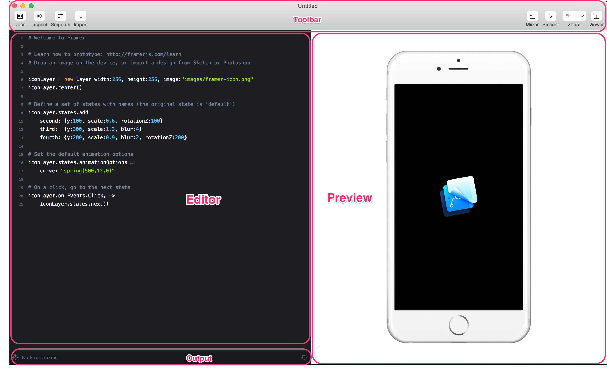
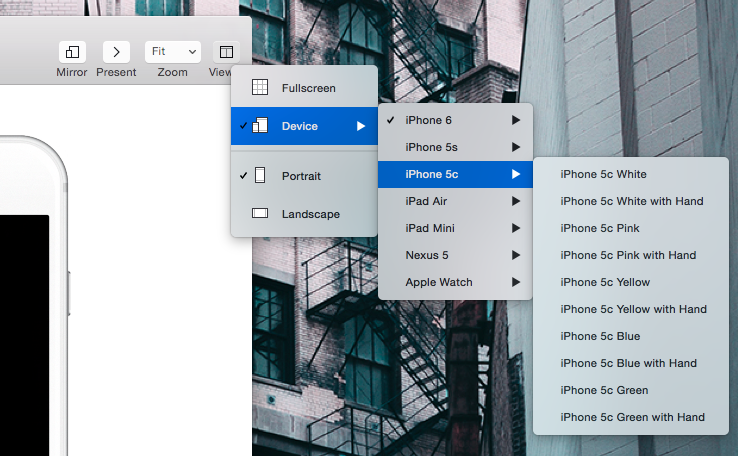
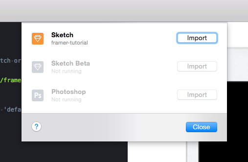
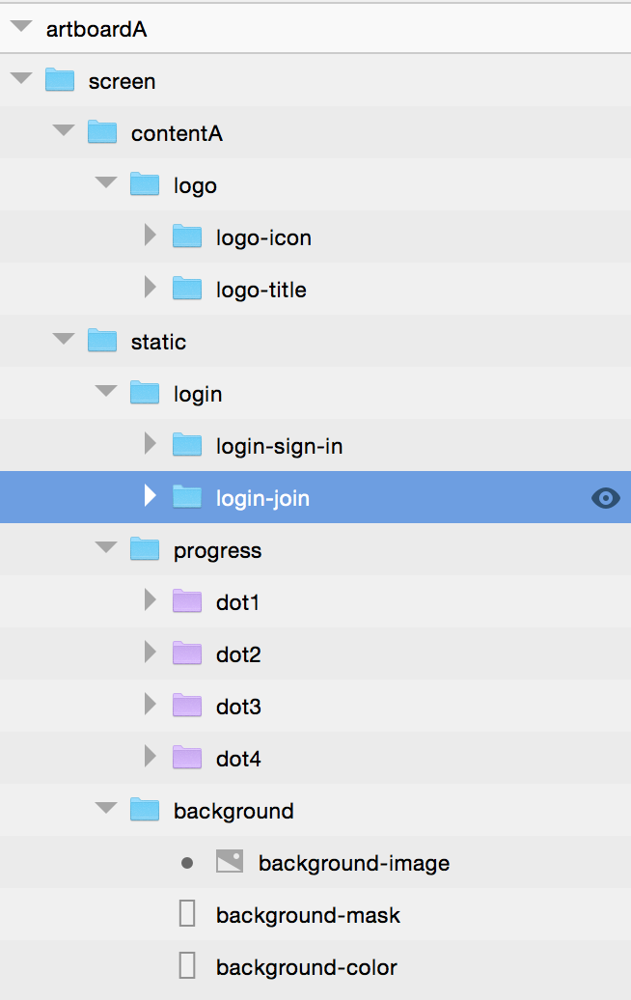

# Framer 101 Cambridge Class

## *Lovingly taught by one Nicholas W. Inzucchi*

### Prerequisite software installs:

[**Framer Studio**](http://framerjs.com/) 
[**Sketch 3.2.2** (Demo)](http://bohemiancoding.com/sketch/) 
[**Cactus** (Optional)](http://cactusformac.com/) 

# What’s The Big Deal?

Framer is a new creative tool to build animation and interaction prototypes. It extends existing design tools like Sketch by allowing designers to begin giving behavior to their pixels. The long-term vision is to invent a new genuinely new design process where visuals and interactions are inherently coupled. Why might you be psyched about Framer in particular?

- **Integration With Sketch** : Importing is a game-changing feature that greatly reduces the production overhead of prototyping. 
- **Instant Preview** : Side-by-side visual preview gives instant visual feedback as you work. Scales effortlessly to iOS and Android. 
- **State Machines** : Interaction designers think in states and transitions. Framer implements this logic directly. 
- **Animation** : Animate any object in 3D space with realistic physics and dynamics. Runs super smooth.
- **Instant Deploy** : Get an on-demand hotlink to your web-hosted design. 

[Carousel Onboarding](http://framerjs.com/examples/preview/#carousel-onboarding.framer)

In this tutorial we’ll scratch the surface of Framer by bringing our mobile dating app to life. Ready? Let’s begin.

# Basic Interface

Framer.js is a Javascript library that can be integrated into any platform. Because these words can be scary to non-developers, the Framer folks (thankfully) produced Framer Studio. Studio is a desktop app that makes creating Framer prototypes ridiculously easy. 

Let’s now take a birds-eye view of everything it provides.

## Toolbar

At its core, Framer Studio is a code-centric text editor. The toolbar shows off most of the functionality that pushes it above and beyond TextEdit:

- *Docs* : Open a lightweight docs window for quick reference without leaving the app. 
- *Inspector* : Open a familiar webkit inspector to aid rapid debugging. 
- *Snippets* : Grab commonly-used starter code to begin scripting in style.
- *Import* : Import static designs to begin coding behaviors.
- *Mirror* : Get an on-demand URL to your web-hosted design. 
- *Present* : Go fullscreen to present to colleagues or clients. 
- *Viewer* : Select how you want your sketch to appear in the Preview frame. 

View options are especially notable…Framer provides a ridiculous quantity. Coded properly, Framer sketches are device-agnostic

## Editor
The **Editor** is where you’ll write code. Code is syntax-highlighted and autocompleted. Try using **View > Show Invisibles** to reveal carriage returns and indentations.

### Output 
At the bottom of the editor, a small output window acts as a reminder for any outstanding bugs.

## Preview
The **Preview** panel provides an instant, auto-refreshed window into the current state of your code. It’s fully interactive and helps strengthen the full loop between code and experience. 

# Importing Assets

At a high level, we want our login screen to double as an application walkthrough. The above screenshot shows how we might document this behavior statically in Sketch, but I think we can do one step better by bringing things to Framer.

One of Framer’s greatest strengths is the ability to integrate tightly with existing design tools. Importing is perhaps the greatest example of this strategy. Let’s use it to import the starter files for our prototype app.

Framer can import assets from Photoshop, Sketch, or Sketch Beta.  In either case, Framer depends upon your file being currently open. Go ahead and open `assets/framer-tutorial.sketch`. If you now click the `Import` icon in the Framer toolbar, you should see the popup above. Select ‘Import’ next to **Sketch** and your file should load in immediately.

## Working With Imported Assets

When working with imported assets, here are some important things to keep top of mind.

- First, only groups are imported. Every group is flattened and imported as a Layer into Framer. Layers not in groups are simply ignored.
- Second, try to name Sketch groups as you would name variables in your code. i.e. Avoid spaces, avoid uppercase, and favor hyphens over underscores (debatable)

## Accessing Imported Layers

In our example code, the following line creates an object containing all imported layers :

``sketch = Framer.Importer.load “imported/framer-tutorial”``

We’ll use this object to select individual layers from our Sketch file. 

The hierarchy and organization of your Sketch file translates directly into Framer (So make sure to keep it tight!). To select a specific Sketch group, for example our home screen content, we can use the following syntax:

``sketch.contentA.opacity = 0.5``

Groups within other groups are called subLayers. Note that in our Sketch file, contentA one subLayer and that subLayer has two of its own. These are also directly accessible. Replace the last line with the following to select only the logo:

``sketch.logoIcon.opacity = 0.5``

# Working With Layers

In our eagerness to hook up Sketch and Framer, we’ve jumped the gun and already started playing with layers. It’s probably a good idea to step back and consider Layers from a more holistic point of view.

In Framer, every object is considered a layer. At their simplest, Layers are simply rectangles that draw elements. Layers get more interesting when used to display images, videos or text.

For our purposes, Layers are groups from Sketch. However, Framer can just as easily create layers from scratch. For example, the following code prompts Framer to creates new rectangle layer:

	layerA = new Layer
	    x:0, y:0, width:100, height:100

## Layer Properties

All layers have certain default properties, namely width, height, position and background color. A full list of additional properties can be found in the [Framer Documentation](http://framerjs.com/docs/). Properties can be defined when a Layer is created, as above, or after the fact, so below: 

	sketch.logoIcon.rotation = 45

Layers are easy to position, too. Each layer has the following properties to help define its position: 

	print sketch.logoIcon.x
	print sketch.logoIcon.minX
	print sketch.logoIcon.maxX
	print sketch.logoIcon.midX
	
	print sketch.logoIcon.y
	print sketch.logoIcon.minY
	print sketch.logoIcon.maxY
	print sketch.logoIcon.midY

# Animations
Layer properties can be animated to change over time. Framer lets the user specify an animation’s length, delay, and number of repetitions. Try out the following to put our logo on spinners:

	logo.animate
	    properties:
	        rotation: 360
	    curve: “linear”
	    repeat: 99
	    time: 2

Animations also let users select an appropriate curve, for example linear, eased, bezier, or spring. Try changing the like `curve: “linear”` to `curve: “ease-in-out”` above.

# States

Animations are cool, but real power comes when using them in tandem with States. States are great because they mirror how we interaction designers think about our applications. They also allow behaviors to be much more reusable. A state is simply a set of properties, attached to a Layer. When you tell that layer to go to a given state, it transitions to that set of properties.

Spinning logos are so 80’s. Let’s use states to turn our logo into a simple squishy button. Uncomment the following chunk:

	logo.states.add
		pressed: {scale:0.9, rotationZ:45}
	
	logo.states.animationOptions =
		curve: “spring(500,15,0)”

The first lines add a new state to the Logo layer. Each layer has an implicit starting state called “default” (you can always remove it with `layer.states.remove(“default”)`. 

The second lines program our layer with a default transition animation. Every time we switch states, Layer properties will tween to their new values using this curve.

# Events

In order to transition between states, we need to listen for certain events. Framer provides a library of Events for each layer. Most are about user interaction, but some are triggered by moments in the execution of your code. Uncomment the following lines to begin playing:

	logo.on Events.Click, ->
		logo.states.next()

Now our Logo will switch between its two states when clicked. To get deeper, re-comment those two lines and instead use the lines just below: 

	logo.on Events.TouchStart, ->
		logo.states.switch(“pressed”)
	    
	logo.on Events.TouchEnd, ->
		logo.states.switch(“default”)

By using the TouchStart and TouchEnd events, you’ll have a much more realistic interaction overall. 

# Tying it Together

Even though we’ve only built a squishy logo, we’ve touched on many of the key concepts Framer has to offer. The following lines (from here to the bottom of the editor) implements a simple carousel to transition between four walkthrough screens. I won’t walk through every line here, but in reading them you’ll learn how to create arrays, assign parents, and create draggable elements. Some simple javascript logic ties things together, checking for the carousel’s release and snapping to the proper position in response. 

# Getting it Out

What good

## Device Mirroring
## Web Exporting